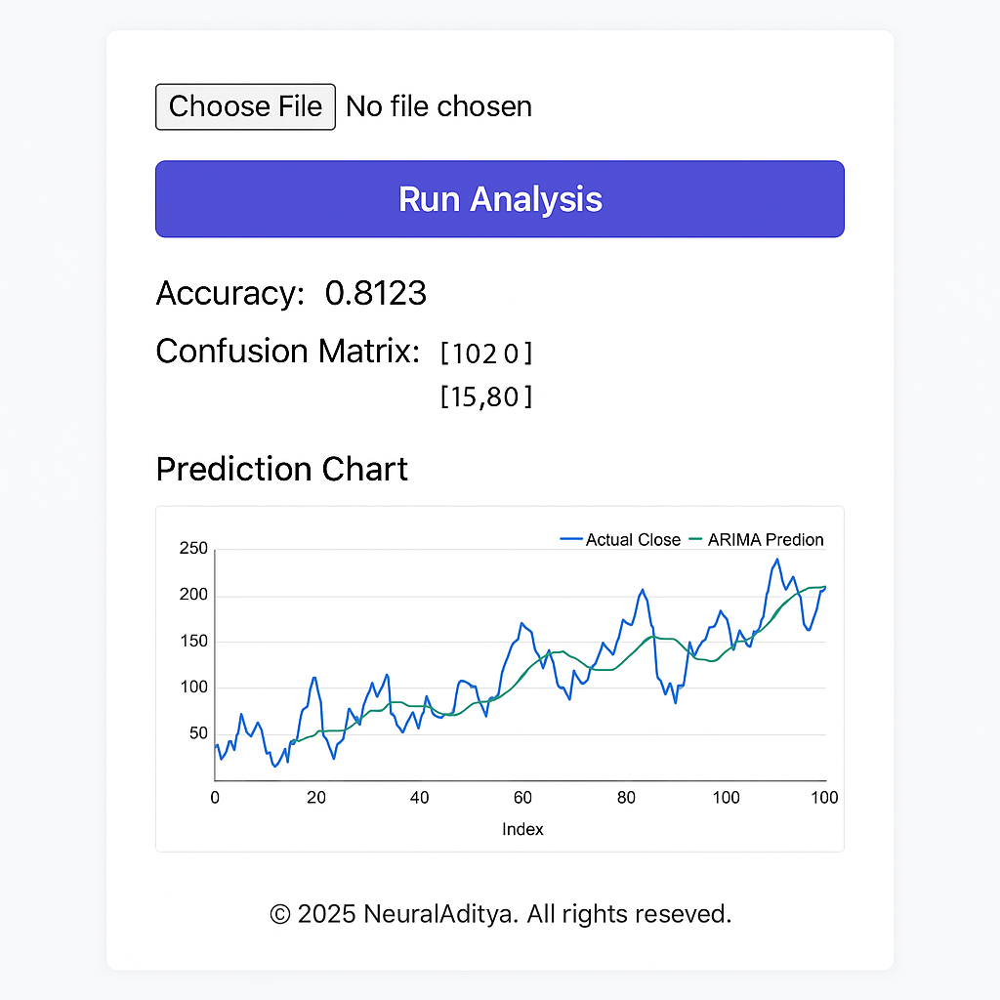

# 🧠 NeuralAditya - Trade Prediction Project

[](#)
[](https://www.python.org/downloads/)
[](https://nodejs.org/)
[](LICENSE)

**Trade Prediction Project** is an advanced and modular trade prediction system that combines state-of-the-art **machine learning** and **signal processing techniques** to provide highly accurate stock trend forecasts.

Built with a powerful **FastAPI backend** and a modern **Vite + React + TailwindCSS frontend**, this full-stack application is optimized for **real-time interaction** and **predictive insight delivery**.

## 🔍 Core Features

- 🔗 **FastAPI Backend**: Lightweight and high-performance API for fast data processing and model predictions.
- ⚛️ **React + Vite Frontend**: Ultra-fast UI built with Vite, React, TailwindCSS, and ShadCN.
- 📈 **ML Algorithms**: Random Forest, ARIMA, and Markov Switching models for robust predictions.
- 🔧 **Fourier Transform Analysis**: Extracts frequency-domain features to capture cyclic trends in data.
- 🌊 **Wavelet Transform**: Multi-resolution analysis to uncover short-term vs long-term volatility patterns.
- 📡 **Kalman Filter**: Smooths noisy market signals and estimates hidden state trends.
- 📐 **Topological Data Analysis (TDA)**: Captures shape and structure of time-series data using persistence diagrams.
- 🧮 **Technical Indicators**: Includes RSI, MACD, EMA, Bollinger Bands, and more.
- 🎯 **Dimensionality Reduction**: Uses PCA and t-SNE for compressing and visualizing high-dimensional features.
- 🖼️ **Live Graphs**: UI displays prediction results and historical performance in interactive charts.
- 🧾 **CSV Upload & Visualization**: Upload any stock OHLCV CSV and view results instantly.

## ⚡ Use Cases

- Short-term & long-term stock trend forecasting
- Backtesting and model evaluation
- Educational tool for data science and trading students
- Research into hybrid models and multi-signal strategies
---

## 📸 Frontend Screenshot

<div align="center">
  
</div>

---

## 📁 Project Structure

```bash
Trade_Predictor_Project/
│
├── backend/
│   ├── api/
│   │   └── predict.py              # Main prediction endpoint logic
│   ├── models/
│   │   └── train_model.py          # (Optional) Re-train ML models
│   ├── utils/
│   │   └── helpers.py              # (Optional) Any helper functions
│   ├── __init__.py
│   ├── main.py                     # FastAPI entrypoint
│   └── requirements.txt           # Backend dependencies
│
├── frontend/
│   ├── src/
│   │   └── TradePredictApp.tsx     # UI for file upload and results
│   ├── public/
│   │   └── screenshot.png          # UI screenshot image
│   ├── package.json
│   ├── postcss.config.js
│   ├── tailwind.config.js
│   ├── vite.config.ts
│   └── tsconfig.json
│
├── docker-compose.yml
├── README.md
└── .gitignore
```

---

## 🚀 Getting Started

### 🧠 Backend (FastAPI)

```bash
cd backend
python -m venv venv
source venv/bin/activate         # On Windows: venv\Scripts\activate
pip install -r requirements.txt
uvicorn main:app --reload
```

Backend will be running at: [http://localhost:8000](http://localhost:8000)

---

### 💻 Frontend (Vite + React)

```bash
cd frontend
npm install
npm run dev
```

Frontend will be running at: [http://localhost:5173](http://localhost:5173)

Ensure the backend is also running for full functionality.

---

## 📤 API Endpoint

### `POST /api/predict`

Upload a `.csv` file with the following required columns:

```
Open, High, Low, Close, Volume
```

#### ✅ Example Response

```json
{
  "accuracy": 0.8123,
  "confusion_matrix": [[100, 20], [15, 80]]
}
```

---

## 🐳 Docker (Run Full Stack)

```bash
docker-compose up --build
```

> Make sure Docker is installed and running before executing.

---

## ✅ Requirements

- Python 3.10+
- Node.js 18+
- Docker (optional)

---

## 📄 License

MIT © 2025 NeuralAditya
